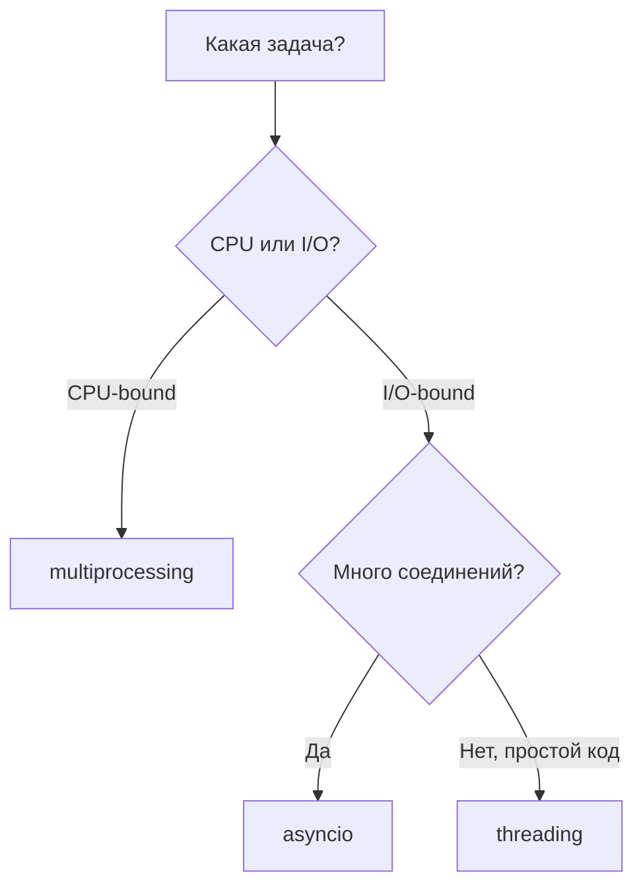

# Замеры и сравнение результатов

Все замеры выполнены на Windows 10, Python 3.14, `NUM_WORKERS=4`.

## Задача 1 — CPU-bound (подсчёт суммы)

Параметры: `QUICK_MODE=1`, `N = 50_000_000`, 4 воркера.

| Подход | Время (с) | Ускорение относительно threading |
|--------|-----------|----------------------------------|
| threading | 1.65 | 1.00× |
| multiprocessing | 0.67 | **2.44×** |
| asyncio | 1.68 | 0.98× |

### Комментарий

**Threading (1.65 с)** — потоки не дают ускорения на CPU-bound задаче: GIL позволяет только одному потоку выполнять Python-байткод в момент времени. Время сопоставимо с однопоточным выполнением.

**Multiprocessing (0.67 с)** — лучший результат. Каждый процесс имеет собственный интерпретатор и свой GIL, поэтому четыре ядра загружаются параллельно. Ускорение ~2.4× при четырёх воркерах (не идеальные 4× из-за накладных расходов на создание процессов и передачу данных).

**Asyncio (1.68 с)** — худший среди «параллельных» вариантов для CPU. Корутины выполняются в одном потоке; `calculate_sum()` — синхронная блокирующая функция, event loop не может переключаться, пока она не завершится. Фактически последовательное выполнение.

---

## Задача 2 — I/O-bound (парсинг веб-страниц)

Параметры: 12 URL, `NUM_WORKERS=4`.

| Подход | Время (с) | Ускорение относительно threading |
|--------|-----------|----------------------------------|
| threading | 3.09 | 1.00× |
| multiprocessing | 3.71 | 0.83× |
| asyncio + aiohttp | 1.24 | **2.49×** |

### Комментарий

**Threading (3.09 с)** — хороший результат для I/O. Пока один поток ожидает ответ сервера, GIL освобождается и другие потоки могут работать. Подходит для сетевых задач с умеренным числом соединений.

**Multiprocessing (3.71 с)** — медленнее threading. Каждый процесс — отдельная копия памяти, затраты на fork/spawn и сериализацию аргументов. Для 12 HTTP-запросов это избыточно.

**Asyncio + aiohttp (1.24 с)** — лучший результат. Один поток обслуживает десятки одновременных соединений без блокировки. Нет накладных расходов на потоки и процессы.

---

## Сводная таблица

| Тип задачи | threading | multiprocessing | asyncio |
|------------|-----------|-----------------|---------|
| CPU-bound (сумма в цикле) | Слабо | **Лучший выбор** | Слабо |
| I/O-bound (HTTP, БД) | Хорошо | Избыточно | **Лучший выбор** |

## Рекомендации по выбору подхода

!!! tip "Практическое правило"
    - Вычисления → `multiprocessing` или `concurrent.futures.ProcessPoolExecutor`
    - Сеть, файлы, БД → `asyncio` или `threading`
    - Не смешивайте без необходимости: для CPU внутри async используйте `run_in_executor`
