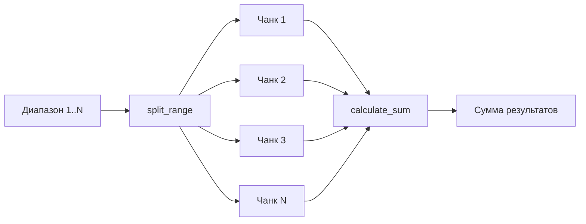

# Задача 1 — Подсчёт суммы

Параллельный подсчёт суммы всех целых чисел от 1 до N с использованием трёх подходов.

## Постановка

- Написать три программы: `threading`, `multiprocessing`, `asyncio`
- Каждая содержит функцию `calculate_sum(start, end)`
- Диапазон `[1, N]` разбивается на несколько подзадач
- Замерить и сравнить время выполнения

По заданию `N = 10_000_000_000_000` (10¹³).

## Файлы

| Файл | Подход | Ключевые модули |
|------|--------|-----------------|
| `task1/threading_sum.py` | Потоки | `concurrent.futures.ThreadPoolExecutor` |
| `task1/multiprocessing_sum.py` | Процессы | `concurrent.futures.ProcessPoolExecutor` |
| `task1/async_sum.py` | Асинхронность | `asyncio`, `async`/`await` |
| `task1/common.py` | Общий код | `calculate_sum()`, `split_range()` |

## Общая логика



### `calculate_sum(start, end)`

Считает сумму целых чисел от `start` до `end` включительно в цикле:

```python
def calculate_sum(start: int, end: int) -> int:
  total = 0
  for i in range(start, end + 1):
    total += i
  return total
```

### `split_range(total, parts)`

Делит диапазон `[1, total]` на `parts` непересекающихся поддиапазонов для параллельной обработки.

## Реализации

### Threading

```python
with ThreadPoolExecutor(max_workers=NUM_WORKERS) as executor:
  futures = [executor.submit(calculate_sum, start, end) for start, end in ranges]
  for future in as_completed(futures):
    total += future.result()
```

Потоки создаются в **одном процессе**. Из-за GIL параллельного выполнения Python-байткода почти нет.

### Multiprocessing

```python
with ProcessPoolExecutor(max_workers=NUM_WORKERS) as executor:
  futures = [executor.submit(calculate_sum, start, end) for start, end in ranges]
```

Каждый воркер — **отдельный процесс** со своим интерпретатором Python. GIL не мешает, загружаются все ядра CPU.

### Asyncio

```python
async def calculate_sum_async(start: int, end: int) -> int:
  return calculate_sum(start, end)

tasks = [asyncio.create_task(calculate_sum_async(start, end)) for start, end in ranges]
results = await asyncio.gather(*tasks)
```

Корутины выполняются в **одном потоке**. Синхронный `calculate_sum()` блокирует event loop, поэтому параллелизма для CPU-bound задачи нет.

## Запуск

```bash
cd task1
python threading_sum.py
python multiprocessing_sum.py
python async_sum.py
```

Пример вывода:

```
Подход: multiprocessing
Диапазон: 1 .. 50,000,000
Число процессов: 4
Результат: 1250000025000000
Ожидаемое: 1250000025000000
Время: 0.6734 с
```

## Настройка

| Переменная | Описание |
|------------|----------|
| `QUICK_MODE=1` | `N = 50_000_000` (для замеров) |
| `QUICK_MODE=0` | `N = 10_000_000_000_000` (по заданию) |
| `NUM_WORKERS` | Число потоков / процессов / задач |

Результаты замеров — в разделе [Замеры и сравнение](benchmarks.md).
