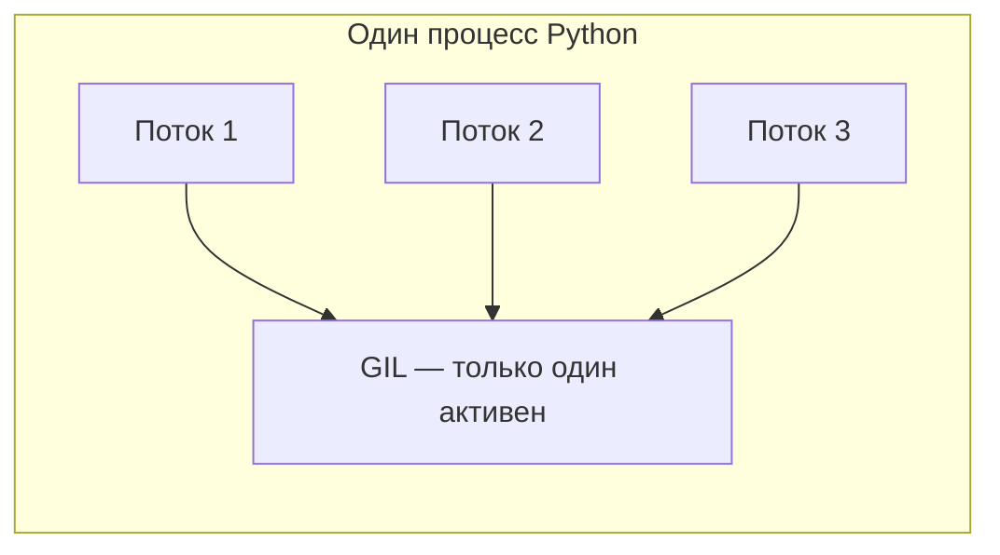

# Теоретические материалы

Краткий конспект по потокам, процессам и асинхронности в Python.

## Потоки (threading)

**Поток** — легковесная единица выполнения внутри одного процесса. Потоки разделяют память процесса.

Основные возможности модуля `threading`:

| Инструмент | Назначение |
|------------|------------|
| `Thread(target=func)` | Запуск функции в отдельном потоке |
| `Lock`, `RLock` | Взаимное исключение при доступе к общим данным |
| `Event`, `Condition` | Синхронизация потоков |
| `Queue` | Потокобезопасная очередь |
| `ThreadPoolExecutor` | Пул потоков для параллельных задач |

```python
from concurrent.futures import ThreadPoolExecutor

with ThreadPoolExecutor(max_workers=4) as pool:
  results = list(pool.map(calculate_sum, ranges))
```

**Когда использовать:** I/O-bound задачи (сеть, диск, БД), когда нужен простой параллелизм без тяжёлых процессов.

## Процессы (multiprocessing)

**Процесс** — отдельный экземпляр программы со своей памятью и своим интерпретатором Python.

| Инструмент | Назначение |
|------------|------------|
| `Process(target=func)` | Запуск функции в новом процессе |
| `Pool` | Пул процессов |
| `ProcessPoolExecutor` | Высокоуровневый пул |
| `Queue`, `Pipe` | Обмен данными между процессами |
| `Value`, `Array` | Разделяемая память |

```python
from concurrent.futures import ProcessPoolExecutor

with ProcessPoolExecutor(max_workers=4) as pool:
  results = list(pool.map(calculate_sum, ranges))
```

**Когда использовать:** CPU-bound задачи — вычисления, обработка данных, математика.

## Асинхронность (asyncio)

**Корутина** — функция `async def`, которую можно приостановить (`await`) и возобновить позже, не блокируя поток.

Ключевые понятия:

| Понятие | Описание |
|---------|----------|
| `async def` | Объявление корутины |
| `await` | Ожидание результата без блокировки потока |
| `asyncio.gather()` | Параллельный запуск нескольких корутин |
| `asyncio.create_task()` | Планирование корутины в event loop |
| Event loop | Цикл, управляющий выполнением корутин |

```python
async def fetch(url):
  async with session.get(url) as response:
    return await response.text()

results = await asyncio.gather(*(fetch(u) for u in urls))
```

**Когда использовать:** большое число одновременных I/O-операций (веб-серверы, парсеры, чат-боты).

!!! warning "Async и CPU"
    `asyncio` **не ускоряет** CPU-bound код. Синхронная функция внутри корутины блокирует весь event loop.
    Для вычислений внутри async используйте `loop.run_in_executor()` или `asyncio.to_thread()`.

## GIL (Global Interpreter Lock)

**GIL** — глобальная блокировка в CPython, которая позволяет только одному потоку выполнять Python-байткод в процессе.



### Зачем нужен GIL

- Упрощает управление памятью (reference counting)
- Защищает внутренние структуры CPython от гонок данных
- Делает C-расширения проще в реализации

### Как с этим жить

| Ситуация | Решение |
|----------|---------|
| CPU-bound, нужен параллелизм | `multiprocessing` |
| I/O-bound | `threading` или `asyncio` |
| CPU внутри async-приложения | `run_in_executor` / `ProcessPoolExecutor` |
| Тяжёлая математика | NumPy, C-расширения (освобождают GIL) |

GIL **отпускается** при I/O-операциях (сеть, диск, sleep), поэтому потоки эффективны для ожидания, но не для чистых вычислений.

## Сравнение подходов

| Критерий | threading | multiprocessing | asyncio |
|----------|-----------|-----------------|---------|
| Параллелизм CPU | Нет (GIL) | Да | Нет |
| Параллелизм I/O | Да | Да | Да |
| Память | Общая | Изолированная | Общая |
| Накладные расходы | Низкие | Высокие | Низкие |
| Сложность кода | Низкая | Средняя | Средняя |
| Масштаб I/O | Десятки потоков | Десятки процессов | Тысячи соединений |

## Рекомендуемые материалы

- [Асинхронность с AsyncIO](https://www.youtube.com/watch?v=6KTjxQbqZ0s) — краткое введение
- [GIL в Python (Григорий Петров)](https://www.youtube.com/watch?v=fwzPF2JLoeU)
- [Плейлист по асинхронности (Олег Молчанов)](https://www.youtube.com/playlist?list=PLIb_jemdBISBkHAZYadc5fC-_e6Ofr_Z4)
