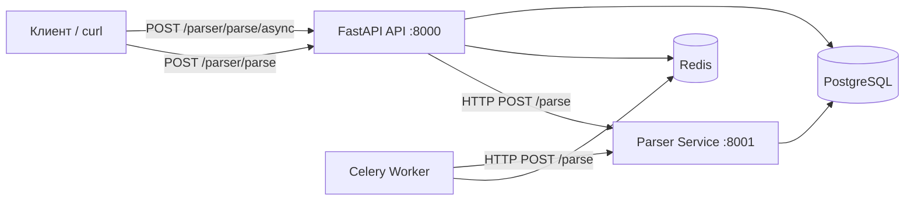

# Архитектура системы

## Общая схема



## Сервисы Docker Compose

```
┌─────────────────────────────────────────────────────────┐
│                    docker-compose                        │
│                                                          │
│  ┌──────────┐   ┌──────────┐   ┌──────────────────┐   │
│  │    db    │   │  redis   │   │  celery_worker   │   │
│  │ Postgres │   │          │   │                  │   │
│  └────┬─────┘   └────┬─────┘   └────────┬─────────┘   │
│       │              │                   │              │
│       └──────┬───────┴───────────────────┘              │
│              │                                          │
│       ┌──────┴──────┐         ┌─────────────┐           │
│       │    parser   │◄────────│     api     │           │
│       │   :8001     │  HTTP   │   :8000     │           │
│       └─────────────┘         └─────────────┘           │
└─────────────────────────────────────────────────────────┘
         ▲                              ▲
         │                              │
    localhost:8001                 localhost:8000
```

## Потоки данных

### Синхронный парсинг

1. Клиент отправляет `POST /parser/parse?url=...` на API.
2. API делает HTTP-запрос к `parser:8001/parse`.
3. Parser загружает страницу, извлекает title, пишет в PostgreSQL.
4. API возвращает JSON клиенту.

### Асинхронный парсинг

1. Клиент отправляет `POST /parser/parse/async?url=...`.
2. API создаёт задачу Celery и сразу возвращает `task_id`.
3. Worker забирает задачу из Redis.
4. Worker вызывает parser service по HTTP.
5. Клиент опрашивает `GET /parser/parse/status/{task_id}`.

## Связь с предыдущими работами

| ЛР | Что используется в ЛР3 |
|----|------------------------|
| ЛР1 | FastAPI-приложение CollabPlatform, модели, миграции Alembic, PostgreSQL |
| ЛР2 | Логика парсинга (`common.py`), модель `ParsedPage`, сохранение title |
| ЛР3 | Docker, Compose, HTTP-микросервис, Celery, Redis, MkDocs |

## Файловая структура

```
lr3/
├── app/
│   ├── main.py              # Точка входа FastAPI
│   ├── celery_app.py        # Конфигурация Celery
│   ├── api/parser.py        # Эндпоинты парсера
│   ├── tasks/parse_tasks.py # Celery-задача
│   ├── core/config.py       # PARSER_URL, CELERY_*
│   └── models/parsed_page.py
├── parser_service/
│   ├── main.py              # HTTP-сервис парсера
│   └── common.py            # Логика из ЛР2
├── docker-compose.yml
├── Dockerfile.api
├── Dockerfile.parser
└── scripts/entrypoint-api.sh
```
